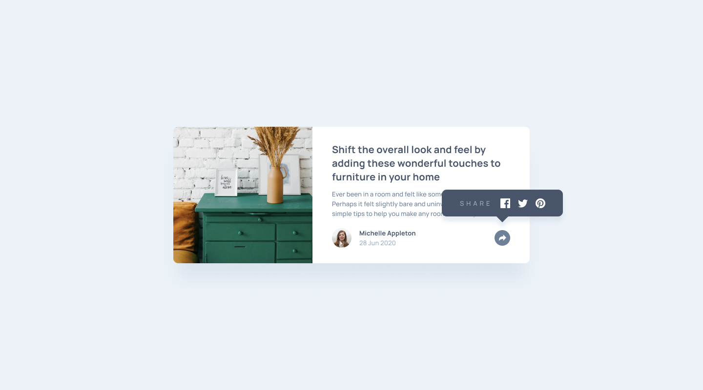
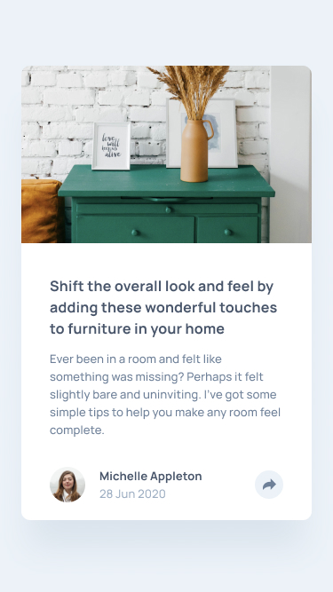

# Article Preview Component

This is a solution to the **Article Preview Component** challenge. It showcases the use of **Tailwind CSS**, **Tippy.js**, **HTML5**, and **JavaScript** to build a responsive and interactive component.

## Table of Contents

- [Article Preview Component](#article-preview-component)
  - [Table of Contents](#table-of-contents)
  - [Overview](#overview)
  - [Features](#features)
  - [Built With](#built-with)
  - [Getting Started](#getting-started)
  - [Installation](#installation)
  - [Usage](#usage)
  - [Screenshots](#screenshots)
    - [Desktop View](#desktop-view)
    - [Mobile View](#mobile-view)
  - [Links](#links)
  - [Author](#author)
  - [License](#license)
  - [Acknowledgments](#acknowledgments)

## Overview

The goal of this challenge was to create a responsive article preview component that adapts to different screen sizes and provides a smooth user experience with interactive elements like tooltips.

## Features

- Responsive design that adapts to different screen sizes (mobile and desktop).
- Interactive tooltips using Tippy.js.
- Clean and modern UI with Tailwind CSS.

## Built With

- **Tailwind CSS** - A utility-first CSS framework for rapidly building custom designs.
- **Tippy.js** - A lightweight and highly customizable tooltip and popover library.
- **HTML5** - The standard markup language for creating web pages.
- **JavaScript** - The programming language for the web, used to add interactivity.

## Getting Started

To get a local copy up and running, follow these steps.

## Installation

1. Clone the repository:

   ```bash
   git clone https://github.com/fawaziwalewa/article-preview-component.git
   ```

2. Navigate to the project directory:

   ```bash
   cd article-preview-component
   ```

3. Open `index.html` in your browser to view the component.

## Usage

This component can be integrated into any web project where you need an article preview with social media sharing options.

## Screenshots

### Desktop View



### Mobile View



## Links

- Solution URL: [GitHub Repository](https://github.com/fawaziwalewa/article-preview-component)
- Live Site URL: [Live Demo](https://fawaziwalewa.github.io/article-preview-component)

## Author

- [GitHub Profile](https://github.com/fawaziwalewa)
- [LinkedIn Profile](https://linkedin.com/in/fawaz-iwalewa)

## License

Distributed under the MIT License. See [LICENSE](LICENSE) for more information.

## Acknowledgments

A special thanks to the creators of Tailwind CSS and Tippy.js for providing such amazing tools that made building this component a smooth experience. I also want to thank Frontend Mentor for the challenge idea.
